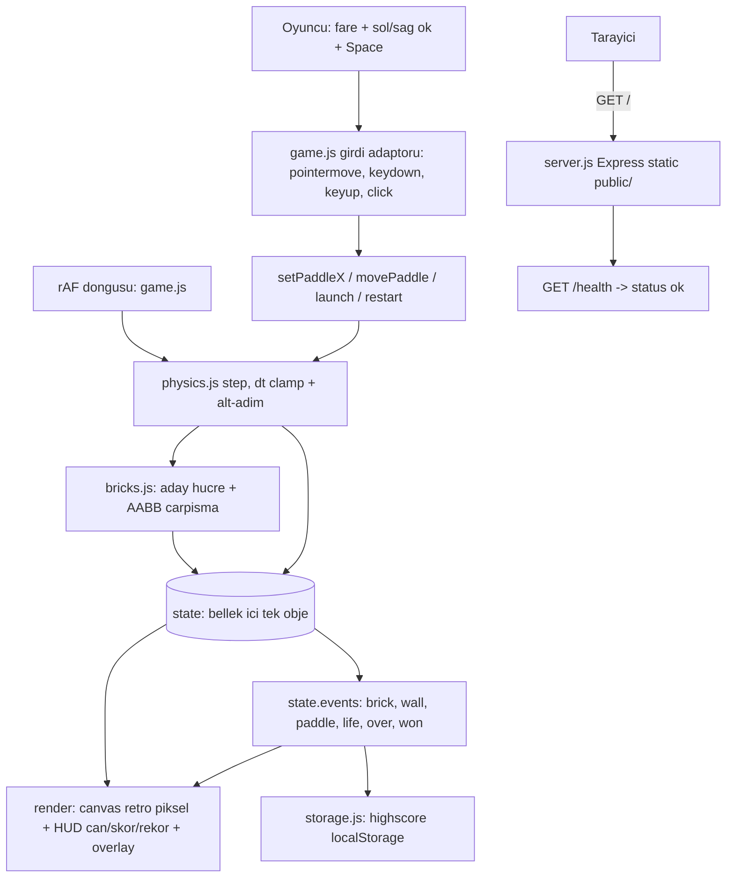

# 05 — Mimari Tasarım: breakout

- Tarih: 2026-07-31 | Mod: AUTOPILOT | Profil: LITE
- Girdi: `docs/03-requirements.md`, `docs/04-solution-analysis.md`, DL-04-001, DL-04-002, DL-04-003

## Genel bakış
Tek sayfalık istemci oyunu: bir `<canvas>`, `requestAnimationFrame` döngüsü ve **saf (DOM'suz) oyun
çekirdeği**. Sunucu yalnız statik dosya servisi + `/health`; oyun state'i hiç sunucuya çıkmaz.
Ana ayrım: **çekirdek** (`physics.js` + `bricks.js` — fizik, çarpışma, kural/durum makinesi) ile
**adaptör** (`game.js` — canvas render, girdi, HUD; `storage.js` — `localStorage` sınırı).
Çekirdek tarayıcı API'si bilmez, adaptör oyun kuralı bilmez. Çekirdek→adaptör iletişimi
`state.events[]` üzerinden olur (adaptör olayı okur, HUD/overlay çizer).

## Bileşen görünümü


## Veri akışı (blok kırma ve can kaybı)
```mermaid
sequenceDiagram
  participant U as Oyuncu
  participant G as game.js
  participant P as physics.js
  participant B as bricks.js
  participant C as Canvas
  U->>G: pointermove / ArrowLeft
  G->>P: setPaddleX veya movePaddle, duvar icine clamp
  loop her kare, dt = min rawDt, 1/30
    G->>P: step state, dt
    P->>P: N = ceil hiz*dt / 4, en fazla 8 alt-adim
    P->>B: aday satir/kolon, en fazla 4 hucre, AABB
    B-->>P: isabet -> alive=false, kucuk penetrasyon ekseninde yansima
    P-->>G: score += 10, bricksBroken++, hiz = speedFor bricksBroken
    G->>C: ayni karede HUD skoru cizilir
  end
  P-->>G: top alt sinirin altinda -> lives-- , phase = serve
  P-->>G: lives 0 -> phase = over ; aliveCount 0 -> phase = won
  G->>SS: highscore guncelle
  G->>C: overlay Oyun bitti / Kazandin + final skor + Yeniden baslat
```

## Dosya / modül yapısı
| Yol | Sorumluluk |
|-----|------------|
| `server.js` | Express: `express.static('public')` + `GET /health` → `{status:"ok"}`, `PORT` env. Stateless. |
| `package.json` | `"type":"module"`, tek dep `express` (sabit sürüm), `start` / `test` script'leri |
| `public/index.html` | `<canvas width=480 height=640>` + HUD + overlay, `<script type="module">` |
| `public/style.css` | Ortalanmış yerleşim, `image-rendering: pixelated`, tam sayı ölçek, bitmap-benzeri monospace font |
| `public/bricks.js` | **Saf:** `LEVEL` grid sabitleri, `createGrid`, `brickRect`, `candidateCells`, `hitBrick` |
| `public/physics.js` | **Saf:** `createState`, `step`, `setPaddleX`, `movePaddle`, `launch`, `speedFor`, `resetBall`, `PHASE` |
| `public/game.js` | rAF döngüsü, canvas render, girdi bağlama (fare + klavye), HUD, overlay, yeniden başlat |
| `public/storage.js` | **Saf/enjekte edilebilir:** `readHighScore(storage)`, `writeHighScore(storage, score)`, try/catch |
| `tests/*.test.js` | `node:test` — çekirdek modülleri DOM'suz doğrudan import edilir (fizik, grid, storage) |
| `Dockerfile` | Faz 12'de eklenir (`node:alpine`, `EXPOSE`, `npm start`) — bu fazda yalnız yer tutucu |

Çekirdek modüller tarayıcıya da Node testine de **aynı ESM dosyası** olarak girer; build/transpile yok (NFR-3).

## Veri modeli
```js
export const PHASE = { SERVE: 'serve', PLAYING: 'playing', OVER: 'over', WON: 'won' };

const state = {
  phase: PHASE.SERVE,   // serve = top paddle üstünde bekliyor (FR-3 can sonrası da buraya döner)
  lives: 3,             // FR-3
  score: 0,             // FR-4 — blok başına +10 (sabit puan, DL-04-002 varsayımı)
  highScore: 0,         // adapter storage.js ile yükler/yazar (FR-4)
  bricksBroken: 0,      // FR-5 hız kademesinin TEK girdisi
  aliveCount: 40,       // FR-3 kazanma koşulu: 0 → PHASE.WON
  world:  { w: 480, h: 640, wall: 8 },                  // iç alan: x ∈ [8, 472], y ≥ 8
  paddle: { x: 208, y: 600, w: 64, h: 12 },             // x = SOL kenar
  ball:   { x: 240, y: 588, vx: 0, vy: 0, r: 4 },       // r = AABB yarı-boyut (8x8 kare top)
  grid:   { rows: 4, cols: 10, w: 40, h: 16, gapX: 4, gapY: 4, offX: 22, offY: 64 },
  bricks: [ /* bricks[row][col] = { alive: true } — konum indeksten türetilir, veriden değil */ ],
  events: []            // step() içinde biriken saf olaylar: brick|wall|paddle|life|over|won
};
```
- `brickRect(grid,row,col) = { x: offX + col*(w+gapX), y: offY + row*(h+gapY), w, h }` → 10×4 = **40 blok**, x 22..458, y 64..140. Renk satır indeksinden gelir (kırmızı/turuncu/yeşil/sarı), puan sabit.
- Türetilen (state'te tutulmayan) değerler: hız büyüklüğü `speedFor(bricksBroken)`, blok konumu, alt-adım sayısı. Tek doğruluk kaynağı ilkesi → test kurulumu sadeleşir, drift olmaz.

## Somut fizik / oyun parametreleri
| Sabit | Değer | Gerekçe |
|-------|-------|---------|
| `V0` / `VMAX` | 260 / 440 px/s | başlangıç oynanabilir, tavan oynanamazlığı engeller (FR-5) |
| `SPEED_EVERY` / `SPEED_STEP` | 5 blok / +0.08 | `speedFor(n) = min(VMAX, V0*(1 + floor(n/5)*0.08))` → 260 → 426 px/s (40 blokta) |
| `PADDLE_SPEED` | 420 px/s | klavye hareketi (FR-1); fare doğrudan takip + clamp |
| `MAX_BOUNCE_ANGLE` | 60° (1.0472 rad) | paddle sekme açısı: `off = clamp((ball.x - pcx)/(w/2), -1, 1)`, `vx = V*sin(off*60°)`, `vy = -V*cos(...)` → kenar = dik açı (FR-2) |
| `LAUNCH_ANGLE` | 20° dikeyden | `launch(state, dir)` deterministik — testte rastgelelik yok |
| `MAX_STEP_PX` / `SUBSTEP_MAX` | 4 px / 8 | `N = min(8, max(1, ceil(V*dt / 4)))` → alt-adım yolu ≤ 4 px = blok yüksekliğinin 1/4 → **tünelleme imkânsız** |
| `DT_MAX` | 1/30 s | sekme arka plana alınınca birikmiş dt ile ışınlanma yok |
| `LIVES` | 3 | FR-3 |
| Grid | 10 kolon × 4 satır, 40×16 px blok, 4 px boşluk | FR-2/FR-3, 40 blok |
| Puan | blok başına 10 (maks 400) | FR-4 |

**Çarpışma çözümü (alt-adım başına sıra ve tek-yansıma kuralı):** ① duvar (sol/sağ/üst → ilgili eksende
yansıma + sınır içine ittirme) → ② paddle (yalnız `vy > 0` iken, açı formülü) → ③ blok: top AABB'sinden
aday satır/kolon aralığı O(1) hesaplanır (≤2×2 = 4 hücre), ilk canlı isabette **küçük penetrasyon
ekseninde** yansıma + `alive=false` + `aliveCount--` → ④ alt sınır (`ball.y - r > world.h`) → can kaybı.
**Alt-adım başına en fazla 1 blok ve eksen başına en fazla 1 yansıma** (köşe vuruşunda çift kırılma /
titreme olmaz — DL-04-002 riskinin karşılığı). Her yansımadan sonra hız vektörü
`speedFor(bricksBroken)`'a normalize edilir (büyüklük türetilmiş, yön state'te).

## Retro piksel görsel yaklaşım
Canvas **mantıksal olarak düşük çözünürlüklüdür** (480×640 backing store, `devicePixelRatio` ölçekleme
YOK) ve CSS ile **tam sayı katına** büyütülür: `scale = max(1, floor(min(vw/480, vh/640)))`.
`ctx.imageSmoothingEnabled = false` + `image-rendering: pixelated` → çıplak, keskin piksel blokları.
Tüm çizimler `Math.round` ile tam sayı koordinata oturur; tüm boyutlar 4'ün katıdır. Sınırlı palet
(koyu lacivert zemin + 4 satır rengi + beyaz top/paddle), `fillRect` dışında primitif yok
(gradient/gölge/anti-alias/yuvarlak köşe yok), HUD büyük harf monospace. Ekstra varlık/sprite dosyası
yoktur → ilk yükleme tek HTML + 4 küçük JS (<50 KB).

## Teknoloji seçimleri
| Katman | Seçim | Alternatifler | DL referansı |
|--------|-------|---------------|--------------|
| Render + oyun döngüsü | Canvas 2D + `requestAnimationFrame`, sıfır istemci bağımlılığı | Phaser 3 / kaboom.js; DOM + CSS | DL-04-001 |
| Çarpışma + blok modeli | Statik `bricks[row][col]` grid + AABB + alt-adımlı hareket | Nesne listesi lineer tarama; matter.js | DL-04-002 |
| Statik servis | Node + minimal Express, `/health`, `node:alpine` | nginx-only imaj; çıplak Node `http` | DL-04-003 |
| Kod organizasyonu | Saf çekirdek (`physics.js`+`bricks.js`) + ince adaptör (`game.js`) + `storage.js` sınırı, olay listesi | Tek dosya monolit; sınıf hiyerarşisi | DL-05-001 |
| Fizik/oyun parametreleri | Türetilmiş hız `speedFor(bricksBroken)`, 4 px alt-adım, ±60° paddle açısı | Doğrusal `vy` artışı; süre-bazlı hızlanma; sürekli-çarpışma (CCD) | DL-05-002 |
| Retro görsel | Düşük çözünürlüklü canvas + tam sayı CSS ölçek + `pixelated` | DPR ölçekleme; sprite sheet; CSS filtre | DL-05-003 |

## NFR ↔ Mimari eşlemesi (kalite kapısı kanıtı)
| NFR | Mimarideki somut karşılığı |
|-----|-----------------------------|
| NFR-1 (~60 FPS) | Kare başına iş sabit ve küçük: 1 top × ≤8 alt-adım × ≤4 aday hücre = **≤32 AABB testi** (40 blokla lineer tarama değil, indeksten O(1) aday) + ≤43 `fillRect`. Ayırma yok (state objesi yeniden kullanılır, `events[]` her karede `length=0` ile boşaltılır → GC baskısı yok). Render `fillRect`'ten ibaret; DOM düğümü yok, reflow yok. `DT_MAX` clamp'i kare atlamalarında fizik patlamasını önler. |
| NFR-2 (blok kırma → skor ≤1 sn) | Yol tamamen **senkron**: `step()` içinde `hitBrick` isabeti `score += 10`'u AYNI çağrıda yapar, HUD **aynı rAF karesinde** çizilir (~16 ms; en kötü `DT_MAX` = 33 ms). Bu yolda ağ/`fetch`/timer/async yok; Express hiç yer almaz. |
| NFR-3 (framework yok, ek derleme yok) | İstemcide **0 runtime bağımlılık**: düz ESM (`<script type="module">`), bundle/transpile/preprocessor adımı YOK; kaynak dosya = servis edilen dosya. Yalnızca standart web API'leri (Canvas 2D, rAF, Pointer/Keyboard events, `localStorage`). Tek npm paketi `express` **yalnız sunucuda**. Aynı ESM çekirdeği Node `node:test` içine değişmeden girer. |
| NFR-4 (en yüksek skor kalıcı) | Kalıcılık tek noktada izole: `storage.js` → `localStorage['breakout.highscore.v1']` (sayı, `readHighScore`/`writeHighScore`). Okuma boot'ta bir kez (HUD'a `highScore`), yazma yalnız oyun bitişinde (`over`/`won` olayında, `score > highScore` ise). `try/catch` sarmalı: gizli sekme/kota hatasında oyun DÜŞMEZ, yalnız kalıcılık kaybolur. Storage enjekte edildiği için sahte storage ile birim-test edilebilir (Faz 11) ve statik kod incelemesiyle doğrulanabilir. |

## ADR listesi
- DL-05-001: Modül yapısı — saf oyun çekirdeği + ince I/O adaptörü + `storage.js` kalıcılık sınırı
- DL-05-002: Fizik/oyun parametreleri — türetilmiş hız, 4 px alt-adım, ±60° paddle sekme formülü
- DL-05-003: Retro piksel render — düşük çözünürlüklü canvas + tam sayı CSS ölçekleme

## Kalite kapısı raporu
- "Kritik NFR'ler mimaride karşılanıyor" → ✅ NFR-1..NFR-4'ün **dördü de** yukarıdaki eşleme tablosunda somut mekanizmaya bağlandı (sabit ≤32 AABB test bütçesi + ayırmasız render; senkron skor yolu; 0-bağımlılık düz ESM; izole `storage.js` sınırı).
- "FR kapsaması" → ✅ FR-1 `setPaddleX`/`movePaddle` + clamp, FR-2 duvar/paddle açı formülü + blok eksen yansıması, FR-3 `lives`/`PHASE.OVER`/`aliveCount`→`WON`, FR-4 `score`+`storage.js`, FR-5 `speedFor(bricksBroken)` + `VMAX`, FR-6 `createState()` ile tam sıfırlama.
- "Mermaid diyagramları" → ✅ bileşen görünümü (`graph TD`) + veri akışı (`sequenceDiagram`).
- Decision Log: `decisions/DL-05-001-module-structure.md`, `decisions/DL-05-002-game-parameters.md`, `decisions/DL-05-003-retro-pixel-render.md`
