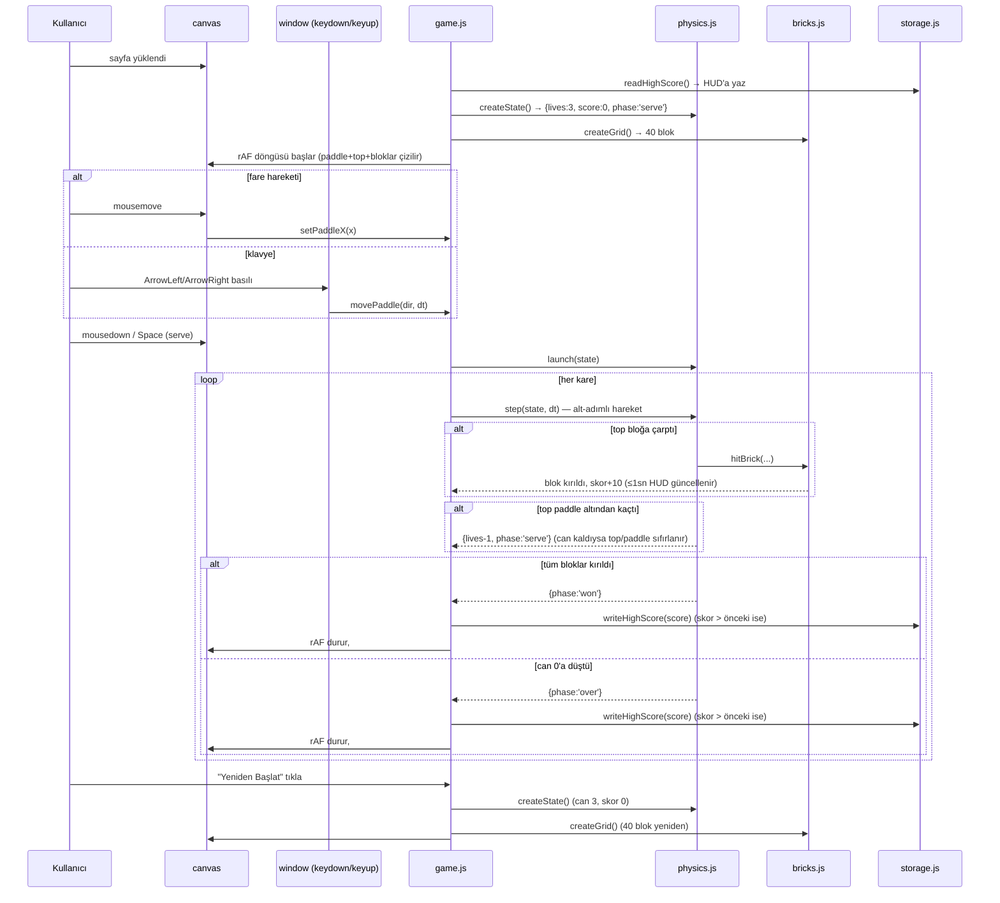

# 06 — UI/UX: breakout

- Tarih: 2026-07-31 | Mod: AUTOPILOT | Profil: LITE
- Ürün tipi: web → tek sayfa (statik HTML + Canvas 2D + vanilla JS — bkz. `docs/05-architecture.md`)

Girdi: `docs/03-requirements.md` (FR-1..6, NFR-1..4), `docs/05-architecture.md`.

## Yüzey sözleşmesi (tek ekran)
| Öğe | Rol | Etkileşim | İlgili FR/NFR |
|-----|-----|-----------|----------------|
| Başlık `<h1>` "Breakout" | Sayfa kimliği | — | — |
| Oyun alanı `<canvas id="game" width="480" height="640">` | Paddle+top+blok çizimi (retro piksel, `fillRect`) | Fare hareketi → paddle takip; `mousedown`/`Space` → topu fırlat | FR-1, FR-2 |
| HUD `
` — Skor + En Yüksek Skor + Can | Anlık skor/can | Blok kırılınca / can azalınca güncellenir | FR-3, FR-4 |
| Klavye dinleyicisi (`window`, `keydown/keyup: ArrowLeft/ArrowRight`) | Paddle kontrolü | Basılı tutma → paddle o yönde hareket | FR-1 |
| Oyun-bitti/kazandın katmanı `
` | Final skor + "Yeniden Başlat" `<button id="restart">` | `over`/`won` durumunda görünür; tıkla → `reset()` | FR-3, FR-6 |

Tüm paddle girdisi (`mousemove` + `ArrowLeft`/`ArrowRight`) `game.js`'teki tek `movePaddle()`/`setPaddleX()` çağrısına yönlenir (bkz. `docs/05-architecture.md`).

## Ana akış — uçtan uca (kalite kapısı)

## Çıktı/görsel şablonları
- **Başlangıç durumu:** Paddle alt-orta, top paddle üzerinde bekler (`serve` fazı), 40 blok üstte 10×4 grid, HUD "Skor: 0 · En Yüksek: N · Can: 3", `#overlay` gizli.
- **Oynama sırasında:** Retro piksel stil — yalnız `fillRect`, `imageSmoothingEnabled=false`, tam sayı ölçek; blok kırıldıkça skor ≤1sn içinde güncellenir (FR-4); top hızı zamanla kademeli artar (FR-5, görsel ipucu yok — davranışsal).
- **Can kaybı:** Top alt sınırı geçince can 1 azalır, top/paddle `serve` fazına döner (kısa duraklama yok — anında yeniden servis edilebilir durum).
- **Kazandın durumu:** Tüm bloklar kırılınca canvas donar, `#overlay` "Kazandın! — Skor: N" + "Yeniden Başlat" butonu (≤1sn, FR-3).
- **Oyun bitti durumu:** Can 0'a düşünce canvas donar, `#overlay` "Oyun bitti — Skor: N" + "Yeniden Başlat" butonu (≤1sn, FR-3).
- **Hata/kenar durumları:** Paddle ekran sınırını aşmaya çalışırsa `clamp` ile durdurulur; JS devre dışıysa `<noscript>` "Bu oyun JavaScript gerektirir" mesajı; `localStorage` erişilemezse (gizli mod/quota) `storage.js` try/catch ile sessizce yok sayar, oyun en yüksek skorsuz devam eder.

## Tasarım notları
- **Palet/kontrast:** Retro piksel — koyu arkaplan + sınırlı, doygun palet (blok satır başına farklı renk); HUD metni yüksek kontrastlı (≥4.5:1 hedefi), monospace font.
- **Boyut:** Bağımlılıksız `index.html` + `game.js` + `physics.js` + `bricks.js` + `storage.js` + 1 CSS, derleme yok (NFR-3).
- **Responsive:** Canvas sabit 480×640 backing store, CSS tam sayı ölçekle (`floor(min(vw/480, vh/640))`) ortalanır — retro piksel netliği korunur; mobil dokunmatik v1 kapsamı dışı (00-idea).
- **Ton:** Retro arcade (brief Q3), coinflip/ball-bounce/snake-game ile tutarlı minimal statik yapı.

## Kalite kapısı raporu
- "Ana kullanıcı akışları uçtan uca çizildi" → ✅ GEÇTİ — tek ana akış (yükle → paddle kontrolü → servis → çarpışma/skor → can kaybı/kazanma/kaybetme → yeniden başlat) Mermaid ile uçtan uca verildi; başlangıç/oynama/can-kaybı/kazandın/oyun-bitti/hata kenar durumları tanımlandı.
