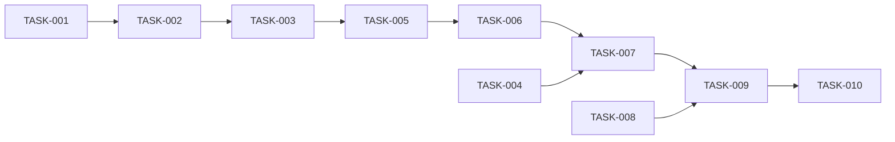

# 08 — Planlama: breakout

- Tarih: 2026-07-31 | Mod: AUTOPILOT | Profil: LITE

> LITE: milestone + önceliklendirilmiş backlog.

## Milestone'lar
| M | Hedef | Kapsanan FR'ler | Hedef tarih |
|---|-------|-----------------|-------------|
| M1 | Oynanabilir breakout (tüm modüller + test + statik yüzey) | FR-1..FR-6 | 2026-07-31 |

## Backlog (önceliklendirilmiş)

### [M1] TASK-001: physics.js çekirdek — createState/setPaddleX/movePaddle/launch
- **Tahmin:** ≤1 gün
- **Bağımlılık:** —
- **FR:** FR-1
- **Kabul:** `createState` başlangıç değerlerini (paddle, top `serve` fazında, lives:3, score:0) üretir; `setPaddleX`/`movePaddle` paddle'ı duvar sınırları içinde tutar (clamp) (test+impl, red→green).

### [M1] TASK-002: physics.js — step/duvar-paddle sekmesi + alt-adımlı hareket (tünelleme önlemi)
- **Tahmin:** ≤1 gün
- **Bağımlılık:** TASK-001
- **FR:** FR-2
- **Kabul:** `step(state, dt)` `dt` clamp'ler (SEC-11), alt-adım sayısını (`N=min(8,...)`) hesaplar; üst/yan duvarda yansıma açısı korunur; paddle'a çarpmada sekme açısı çarpma noktasına göre değişir (DL-05-002 formülü) (test+impl, red→green).

### [M1] TASK-003: bricks.js — createGrid/brickRect/hitBrick + can kaybı/kazanma geçişi
- **Tahmin:** ≤1 gün
- **Bağımlılık:** TASK-002
- **FR:** FR-2, FR-3
- **Kabul:** 40 blok grid'i oluşur; top bloğa çarpınca blok kırılır + skor+10, ilgili eksende yön değişir; top alt sınırı geçince can-1 (`serve`'e döner); tüm bloklar kırılınca `won`, can 0'a düşünce `over` (test+impl, red→green).

### [M1] TASK-004: storage.js — readHighScore/writeHighScore (SEC-8/SEC-9 güvenli parse)
- **Tahmin:** ≤1 gün
- **Bağımlılık:** —
- **FR:** FR-4
- **Kabul:** Bozuk/enjekte/aralık-dışı değer → `0`'a düşer (clamp 0..SCORE_MAX); `try/catch` ile depo erişilemezse sessizce yok sayar (test+impl, red→green).

### [M1] TASK-005: game.js — rAF döngüsü + canvas render (retro piksel: paddle/top/bloklar)
- **Tahmin:** ≤1 gün
- **Bağımlılık:** TASK-003
- **FR:** FR-1, FR-2, NFR-1
- **Kabul:** Her karede `step`+çarpışma çağrılır, `fillRect` ile çizilir, `imageSmoothingEnabled=false`; `innerHTML`/`eval` YOK (SEC-7) (test+impl, red→green).

### [M1] TASK-006: game.js — fare+klavye girdisi (setPaddleX/movePaddle) + serve/launch
- **Tahmin:** ≤1 gün
- **Bağımlılık:** TASK-005
- **FR:** FR-1, FR-6
- **Kabul:** `mousemove` ve `ArrowLeft`/`ArrowRight` ikisi de paddle'ı hareket ettirir, biri diğerini engellemez; `mousedown`/`Space` topu fırlatır (SEC-12 allowlist) (test+impl, red→green).

### [M1] TASK-007: game.js — HUD (skor/en-yüksek/can) + kazandın/oyun-bitti overlay + restart
- **Tahmin:** ≤1 gün
- **Bağımlılık:** TASK-004, TASK-006
- **FR:** FR-3, FR-4, FR-6
- **Kabul:** `won`/`over` durumunda overlay ≤1sn içinde final skorla görünür, en yüksek skor güncellenirse `storage.js` üzerinden yazılır; "Yeniden Başlat" tüm state'i sıfırlar (test+impl, red→green).

### [M1] TASK-008: server.js — Express statik servis + /health + güvenlik header'ları
- **Tahmin:** ≤1 gün
- **Bağımlılık:** —
- **FR:** Faz 5 mimarisi
- **Kabul:** SEC-1, SEC-2, SEC-3, SEC-4, SEC-5, SEC-13 uygulanır (test+impl, red→green).

### [M1] TASK-009: index.html + style.css statik yüzey
- **Tahmin:** ≤1 gün
- **Bağımlılık:** TASK-007, TASK-008
- **FR:** Faz 6 sözleşmesi
- **Kabul:** CSP uyumlu (inline script yok, modüller ayrı dosya), canvas tam sayı ölçekle ortalanır (retro piksel netliği).

### [M1] TASK-010: Entegrasyon testleri + npm test yeşil + coverage + DL-09-001 + kapı doğrula
- **Tahmin:** ≤1 gün
- **Bağımlılık:** TASK-009
- **FR:** NFR-1, NFR-2, Faz 9 kapanışı
- **Kabul:** `npm test` tümü yeşil, coverage ≥%70, DL-09-001 yazıldı, `verify-gate.mjs 9 --level all` geçti.

## Bağımlılık grafı (kalite kapısı: çevrimsiz)

## Kalite kapısı raporu
- "Her task 1 günden küçük" → ✅ (her TASK "Tahmin: ≤1 gün")
- "Bağımlılık grafı çevrimsiz" → ✅ (doğrusal zincir + TASK-004/TASK-008 yan dalları, geri dönüş yok)
